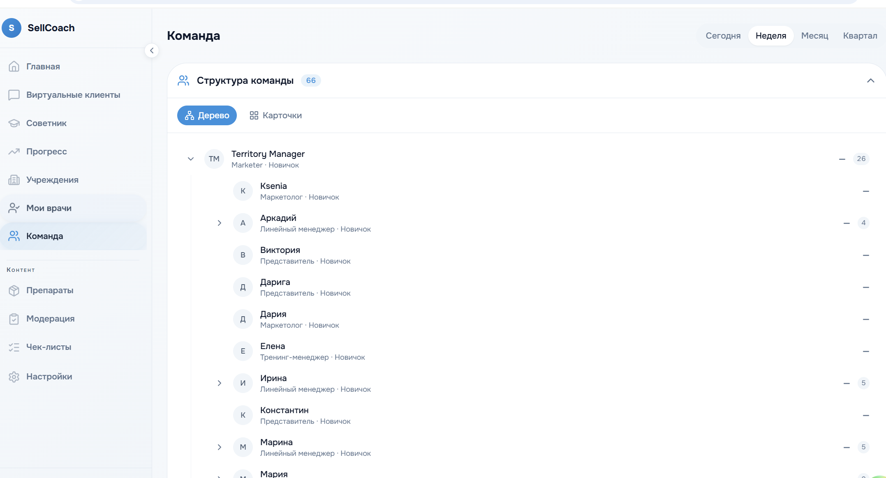

<div align="center">

# Sidearm

**Your mouse buttons, your rules.**

Desktop workflow studio for multi-button mice.
Turn 36 buttons into a personal command center.

[](LICENSE)
[](#requirements)
[](https://v2.tauri.app)

[**English**](#-what-is-sidearm) | [**Русский**](#-что-такое-sidearm)

</div>

---

## EN What is Sidearm?

Sidearm turns a multi-button mouse into a **per-app productivity powerhouse**. Each of the 36 buttons can trigger keyboard shortcuts, paste text, launch apps, run macro sequences, and more. Switch between apps -- and the button layout switches with you automatically.

Built with **Tauri v2** (Rust + React). Single-process, native Windows app. No Electron, no Python, no bloat.

### The Problem

You have a gaming mouse with 12+ thumb buttons. Outside of games, they collect dust. Razer Synapse lets you bind them to keys, but:

- Bindings are global -- the same in every app
- No per-app profiles that switch automatically
- No macros with timing, no text paste, no sequences
- No visual feedback on what each button does

### The Solution

Sidearm intercepts the key signals your mouse sends (F13--F24, etc.) and maps them to **context-aware actions** based on which application is currently in focus.

### Features

| Feature | Description |
|---------|-------------|
| **36 buttons** | 12 thumb + 5 top + scroll + Hypershift doubles everything |
| **9 action types** | Keyboard shortcut, mouse action, text snippet, macro, app launch, media key, profile switch, context menu, disable |
| **Per-app profiles** | Automatic switching when you Alt+Tab. Excel, VS Code, browser -- each gets its own layout |
| **Two layers** | Standard + Hypershift: every button has two bindings |
| **Macro recorder** | Record keystrokes with timing, edit delays, add text/launch steps |
| **Live diagnostics** | Test button bindings in real time, see the full signal resolution chain |
| **Heatmap** | See which buttons you actually use (execution counter on each button) |
| **Verification** | Step-by-step hardware test of every button mapping |
| **Logging** | Persistent log files with rotation + real-time in-app log viewer |
| **Portable** | Single .exe, no installer needed |

### Screenshot



---

## Prerequisites: Setting Up Razer Synapse

Before using Sidearm, you need to configure Razer Synapse to emit **unique key signals** for each mouse button. Sidearm intercepts these signals and maps them to actions.

### Step 1: Open Razer Synapse

Open Razer Synapse and select your Naga mouse.

### Step 2: Remap Thumb Buttons to F13--F24

For each of the 12 thumb buttons, assign a unique function key that isn't used by your keyboard:

| Thumb Button | Recommended Key |
|-------------|----------------|
| 1 | F13 |
| 2 | F14 |
| 3 | F15 |
| 4 | F16 |
| 5 | F17 |
| 6 | F18 |
| 7 | F19 |
| 8 | F20 |
| 9 | F21 |
| 10 | F22 |
| 11 | F23 |
| 12 | F24 |

### Step 3: Remap Top Buttons

For the DPI and extra top buttons, use modifier + F-key combinations:

| Top Button | Recommended Key |
|-----------|----------------|
| DPI Up (D+) | Ctrl+Shift+F13 |
| DPI Down (D-) | Ctrl+Shift+F14 |
| Button 4 (Back) | Mouse 4 (keep default) |
| Button 5 (Forward) | Mouse 5 (keep default) |

### Step 4: Configure Hypershift Layer

Repeat the same mapping for the Hypershift layer, but use **different** modifier combinations (e.g., Ctrl+Alt+F13 through Ctrl+Alt+F24). This gives you a second set of 12+ buttons accessible by holding the Hypershift trigger.

### Step 5: Launch Sidearm

Once Synapse is configured, launch Sidearm. It will intercept the F13--F24 signals and execute your configured actions instead.

> **Tip:** Sidearm starts intercepting on launch. You can verify each button works in the **Diagnostics** tab by entering a signal code (e.g., `F13`) and clicking **Test**.

---

## Installation

### Portable (recommended)

1. Download `Sidearm.exe` from [Releases](https://github.com/danscMax/Sidearm/releases)
2. Place it anywhere on your drive
3. Run it -- that's it

No installer, no registry entries, no admin rights needed.

### Requirements

- **Windows 10** version 1809+ or **Windows 11**
- **WebView2 Runtime** (bundled with Windows 11; on Windows 10 use the included installer in `resources/`)
- **Razer Synapse** for initial mouse button remapping

---

## Usage Tips

### Recommended Shortcuts for Productivity

Here are some high-value bindings to get started:

| Button | Excel | VS Code | Browser |
|--------|-------|---------|---------|
| 1 | Ctrl+C (Copy) | Ctrl+Shift+P (Command) | Ctrl+T (New tab) |
| 2 | Ctrl+V (Paste) | Ctrl+P (Quick open) | Ctrl+W (Close tab) |
| 3 | Ctrl+Z (Undo) | Ctrl+Shift+F (Search) | Ctrl+L (Address bar) |
| 4 | Ctrl+S (Save) | Ctrl+` (Terminal) | Ctrl+Shift+T (Reopen) |
| 5 | Ctrl+F (Find) | Ctrl+B (Sidebar) | F5 (Refresh) |
| 6 | Delete | Ctrl+D (Multi-cursor) | Ctrl+J (Downloads) |

### Hypershift = Double Your Buttons

Hold the Hypershift button and every thumb key becomes a **second action**. Use the Standard layer for frequent operations and Hypershift for less common ones.

### Profile Auto-Switching

Create profiles in the **Profiles** tab and add application rules. Sidearm detects the foreground window and switches profiles automatically. You'll see an OSD notification in the corner when it switches.

---

## Building from Source

```bash
# Requirements: Node.js 20+, Rust 1.77+, Windows 10/11

# Clone
git clone https://github.com/danscMax/Sidearm.git
cd Sidearm

# Install dependencies
npm install

# Development (hot reload)
cargo tauri dev

# Portable release build
.\build_portable.bat
# Output: ..\Sidearm-Portable\Sidearm.exe
```

## Architecture

```
Mouse button press (F13)
    -> Windows LL keyboard hook intercepts the signal
    -> Resolver: active window -> app rule -> profile -> button -> binding
    -> Executor: sends keystrokes / types text / launches app / plays macro
    -> UI: diagnostics, heatmap, and log viewer update in real time
```

### Tech Stack

| Layer | Technology |
|-------|-----------|
| Backend | Rust, `windows-sys`, low-level keyboard hooks |
| Frontend | React 19, TypeScript, Vite 8 |
| Framework | Tauri v2 (single process, ~18 MB binary) |
| Logging | `tauri-plugin-log` v2 (file rotation + real-time viewer) |

---

<div align="center">

# RU Что такое Sidearm?

</div>

Sidearm превращает многокнопочную мышь в **контекстно-зависимый центр продуктивности**. Каждая из 36 кнопок может выполнять клавиатурные сочетания, вставлять текст, запускать приложения, проигрывать макросы. Переключаете окно -- раскладка кнопок переключается автоматически.

Построен на **Tauri v2** (Rust + React). Нативное Windows-приложение в одном процессе. Без Electron, без Python.

### Проблема

У вас игровая мышь с 12+ боковыми кнопками. Вне игр они простаивают. Razer Synapse позволяет привязать их к клавишам, но:

- Привязки глобальные -- одинаковые во всех приложениях
- Нет автоматического переключения профилей по приложениям
- Нет макросов с таймингами, вставки текста, последовательностей
- Нет визуальной обратной связи, что делает каждая кнопка

### Решение

Sidearm перехватывает сигналы клавиш (F13--F24 и т.д.) от мыши и выполняет **контекстно-зависимые действия** в зависимости от активного приложения.

### Возможности

| Функция | Описание |
|---------|----------|
| **36 кнопок** | 12 боковых + 5 верхних + колесо + Hypershift удваивает все |
| **9 типов действий** | Сочетания клавиш, действия мыши, текст, макросы, запуск приложений, медиа, переключение профилей, контекстное меню |
| **Профили по приложениям** | Автоматическое переключение при Alt+Tab. Excel, VS Code, браузер -- у каждого своя раскладка |
| **Два слоя** | Стандартный + Hypershift: каждая кнопка имеет два назначения |
| **Запись макросов** | Запись нажатий с таймингами, редактирование задержек |
| **Живая диагностика** | Тестирование привязок в реальном времени |
| **Тепловая карта** | Счетчик нажатий на каждой кнопке |
| **Верификация** | Пошаговая проверка каждого назначения |
| **Логирование** | Лог-файлы с ротацией + просмотрщик в приложении |
| **Портативность** | Один .exe, без установщика |

### Скриншот


---

## Подготовка: настройка Razer Synapse

Перед использованием Sidearm нужно настроить Razer Synapse, чтобы кнопки мыши отправляли **уникальные сигналы**.

### Шаг 1: Переназначьте боковые кнопки на F13--F24

| Кнопка | Рекомендуемая клавиша |
|--------|----------------------|
| 1 | F13 |
| 2 | F14 |
| 3 | F15 |
| 4 | F16 |
| 5 | F17 |
| 6 | F18 |
| 7 | F19 |
| 8 | F20 |
| 9 | F21 |
| 10 | F22 |
| 11 | F23 |
| 12 | F24 |

### Шаг 2: Переназначьте верхние кнопки

| Кнопка | Рекомендуемая клавиша |
|--------|----------------------|
| DPI+ | Ctrl+Shift+F13 |
| DPI- | Ctrl+Shift+F14 |
| Назад | Mouse 4 (по умолчанию) |
| Вперед | Mouse 5 (по умолчанию) |

### Шаг 3: Настройте слой Hypershift

Повторите те же назначения для Hypershift-слоя, но с другими модификаторами (например, Ctrl+Alt+F13 -- Ctrl+Alt+F24).

### Шаг 4: Запустите Sidearm

Sidearm перехватит сигналы F13--F24 и выполнит настроенные вами действия.

> **Совет:** Проверить работу каждой кнопки можно на вкладке **Диагностика** -- введите код сигнала (например, `F13`) и нажмите **Проверить**.

---

## Установка

### Портативная версия (рекомендуется)

1. Скачайте `Sidearm.exe` из [Releases](https://github.com/danscMax/Sidearm/releases)
2. Поместите в любую папку
3. Запустите

Не нужен установщик, права администратора или записи в реестр.

### Требования

- **Windows 10** (1809+) или **Windows 11**
- **WebView2 Runtime** (встроен в Windows 11; для Windows 10 используйте установщик из `resources/`)
- **Razer Synapse** для первоначальной настройки кнопок мыши

---

## Рекомендуемые сочетания

| Кнопка | Excel | VS Code | Браузер |
|--------|-------|---------|---------|
| 1 | Ctrl+C (Копировать) | Ctrl+Shift+P (Палитра) | Ctrl+T (Новая вкладка) |
| 2 | Ctrl+V (Вставить) | Ctrl+P (Быстрый доступ) | Ctrl+W (Закрыть вкладку) |
| 3 | Ctrl+Z (Отменить) | Ctrl+Shift+F (Поиск) | Ctrl+L (Адресная строка) |
| 4 | Ctrl+S (Сохранить) | Ctrl+` (Терминал) | Ctrl+Shift+T (Вернуть) |
| 5 | Ctrl+F (Найти) | Ctrl+B (Боковая панель) | F5 (Обновить) |
| 6 | Delete | Ctrl+D (Мульти-курсор) | Ctrl+J (Загрузки) |

---

## Сборка из исходников

```bash
# Требования: Node.js 20+, Rust 1.77+, Windows 10/11

git clone https://github.com/danscMax/Sidearm.git
cd Sidearm
npm install
cargo tauri dev           # разработка
.\build_portable.bat      # портативная сборка
```

---

<div align="center">

## License

[MIT](LICENSE)

</div>
